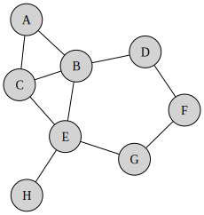

# Robot movement example

This activity synthesis example consists of two robots (`robot1` and `robot2`) that must together visit eight different locations exactly once.
These eight locations are connected via edges, as shown below.
Robots can only move between locations that are connected by an edge.

Robot 1 (non-deterministically) starts in location `A`, `B` or `C`, whereas robot 2 always starts at location `F`.
Moreover, users must be able to indicate which robot should make the first move, via an `initiator` variable.

The goal of this example is to synthesize a UML activity that controls the robots to together visit every location exactly once.
This synthesized activity should correctly handle the multiple possible starting locations, as well as the initiating robot.
Furthermore, the synthesized activity should be deadlock-free, and be maximally parallel.

## Opening the example in SynthML

To open the robot movement example in SynthML:
1. Create a new UML project in SynthML, via _File_ -> _New_ -> _UML Project_.
2. Open the SynthML viewpoint: right-click on the newly created UML project, click _Viewpoints Selection_, enable the _A_SynthML_ checkbox, and click _OK_.
3. Copy and paste the `model.uml` and `representations.aird` files that are in this directory, to the newly created UML project, replacing the original two files in the UML project.

In the _Outline_ view, you should now be able to see the contents of the UML model by clicking on the small arrow left of the `model.uml` file.
Inside `<Model> Model`, you can double-click on `Model Class Diagram` to see a diagram of the UML class containing the variables, requirements, specification of the to-be-synthesized activity, etc., of the example.
The two robots are defined as variables `robot1` and `robot2`, which are of type `Location`, which is defined as an enumeration with literals for the eight locations (`LocA`, `LocB`, etc.)
The Boolean variables `visitedA`, `visitedB`, etc., indicate whether the corresponding location has been visited.
The `initiator` variable indicates which robot should make the first move.

In the _Outline view_, inside `<Class> System`, you can explore the actions for moving the robots.
For example, `<<FormalElement>> <Opaque Behavior> robot1_A_to_B` moves `robot1` from location `LocA` to location `LocB`.
This action has guard `robot1 = LocA`, and effects `robot1 := LocB, visitedB := true, initiator := IRRELEVANT`, as can be seen in the _SynthML_ tab as part of the _Properties_ view.

Apart from the actions, you can also explore the requirements of the example system.
For example, `Requirement_LocA_visited` expresses the requirement that any robot can only move to location `LocA` when that location has not yet been visited.
And `Requirement_ROBOT1_initiating` expresses that `robot1` can only move if `robot2` should not move first.

The to-be-synthesized activity is specified in `<Activity> controller`.
This activity does not contain nodes nor control flows, but rather has preconditions and postconditions expressing what the activity must accomplish (i.e., letting the robots together visit every location exactly once).
These pre- and postconditions are indicated as `<<SynthesisPrecondition>> <Constraint> precondition` and `<<Postcondition>> <Constraint> postcondition`, respectively.
The exact pre- and postcondition expressions can be seen in the _SynthML_ properties tab of these UML constraints.

## Synthesis of the example system

To synthesize a concrete activity for `<Activity> controller` that satisfies its pre- and postconditions as well as all requirements:
1. Right click on the `model.uml` file, and click _Perform synthesis_.
2. After a few seconds, activity synthesis will terminate. The synthesis algorithm might give a warning that the requirement `Requirement_LocF_visited` was not used. This is expected: no robot will move to location `LocF` since robot 2 already started there.
3. The synthesized activity algorithm will have created the `output/1-controller` directory. In that directory, open the bottom-most UML file in that directory.
4. In that UML file, navigate to the `<Activity> controller` activity, right-click on it, click _New Representation_, and click _controller Activity Diagram_ to get a diagram representation of the synthesized activity.

The synthesized activity shows that the two robots can operate concurrently, since their actions are in-between fork and join nodes.
The action sequence of robot 1 depends on its starting location.
The right action sequence is enforced by the incoming guards on the outgoing control flows of the decision node.
(These incoming guards are equivalent to `robot1 = LocA` and `robot1 = LocC`, for the actions to move `robot1` to locations `A` and `C`, respectively.)
Note that robot 1 can never start at location `B`, which is enforced by the incoming guard on the outgoing control flow of the initial node.
(This incoming guard is equivalent to `robot1 != LocB`.)
Finally, outgoing guards have been added to the incoming control flows of the first move actions, which ensure that the right robot moves first.
(These outgoing guards are equivalent to `initiator != ROBOT1` and `initiator != ROBOT2`.)